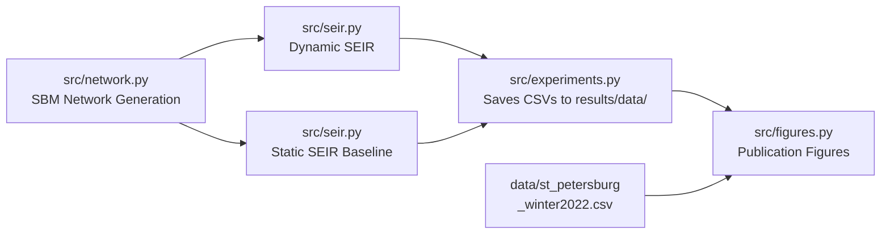

# Dynamic Urban Network Topologies and Epidemic Dynamics

> A comparative study of static vs. adaptive contact networks for COVID-19 modeling.

[](LICENSE)
[](https://www.python.org/)
[]()

**Author:** Yasir Abbas — Group J4133, ITMO University
**Supervisor:** Prof. Vasiliy Leonenko, PhD
**Programme:** Applied Mathematics and Computer Science (01.04.02)

---

## Overview

This repository contains the complete research artifact for a comparative study of **static vs. dynamic SEIR epidemic models** on synthetic urban contact networks across three city topologies — **Dense, Polycentric, and Sparse**. The dynamic model layers weekly contact rhythms and threshold-based behavioural adaptation on top of a Stochastic Block Model (SBM) substrate, and is validated against a St. Petersburg COVID-19 reference curve (Winter 2022).

The codebase is modular and reproducible: a student can clone the repo, install dependencies, and regenerate every figure and metric from scratch with two commands.

## Problem Statement

Traditional SEIR models assume static contact networks where behaviour never changes during an outbreak. This contradicts empirical mobility data — people adapt their contact patterns in response to perceived risk.

**Research question:** How do dynamic contact patterns (weekly rhythms + behavioural adaptation) change epidemic predictions compared to static models, and how does the effect depend on urban topology?

## Objectives

1. Generate three urban contact networks (Dense, Polycentric, Sparse) via Stochastic Block Model.
2. Implement a dynamic SEIR model with weekly contact multipliers and prevalence-threshold behavioural adaptation.
3. Run stochastic simulations and compare against static baselines.
4. Validate against a St. Petersburg COVID-19 reference curve (Winter 2022).
5. Derive city-specific intervention timing guidelines.

## Workflow



## Tools and Technologies

| Category             | Stack                            |
| -------------------- | -------------------------------- |
| Language             | Python 3.10+                     |
| Network science      | NetworkX, NumPy                  |
| Statistics           | SciPy                            |
| Visualisation        | Matplotlib                       |
| Data                 | St. Petersburg COVID-19 (public) |

## Repository Structure

```
.
├── src/                              # Research code
│   ├── __init__.py
│   ├── network.py                    # SBM network generation
│   ├── seir.py                       # Dynamic / static SEIR simulator
│   ├── experiments.py                # Experiment driver (CLI)
│   ├── analysis.py                   # Statistical metrics (CLI)
│   └── figures.py                    # Publication figure generation (CLI)
├── data/                             # Input data
│   ├── README.md
│   └── st_petersburg_winter2022.csv  # Validation reference curve
├── notebooks/                        # Exploratory notebooks (placeholder)
├── figures/                          # Generated PNG figures
├── results/                          # Final deliverables
│   ├── data/                         # CSVs produced by experiments.py
│   ├── Yasir-presentation-new.pptx
│   └── Yasir-presentation-speaker-notes.pdf
└── docs/
    ├── related_work.md               # Review of similar solutions
    └── preprint.md                   # IEEE-style preprint
```

## Installation

```bash
# Clone
git clone https://github.com/yasiraabs123/urban-epidemic-research-final.git
cd urban-epidemic-research-final

# Virtual environment
python -m venv .venv
# Windows
.venv\Scripts\activate
# macOS / Linux
source .venv/bin/activate

# Dependencies
pip install -r requirements.txt
```

## How to Run

All commands run from the repository root.

### Step 1 — Run the experiment suite

```bash
python -m src.experiments --runs 30 --seed 42
```

This builds the three SBM networks, runs 30 stochastic SEIR simulations per network under both static and dynamic regimes (180 simulations total), and writes results to `results/data/`:

- `network_stats.csv` — structural properties of each network
- `curves_<network>_<regime>.csv` — daily infection counts per run
- `summary.csv` — peak day, peak height, and attack rate per run

### Step 2 — Generate the publication figures

```bash
python -m src.figures
```

This reads the CSVs from `results/data/` and writes figures to `figures/`:

- `fig1_networks.png` — network structural properties
- `fig2_static_vs_dynamic.png` — outbreak curves per regime
- `fig3_behavior.png` — behavioural scenario analysis on Dense
- `fig4_timing.png` — optimal intervention timing by topology
- `fig5_validation.png` — model vs St. Petersburg reference curve
- `fig_stats_summary.png` — summary metrics

### Step 3 — Print statistical analysis

```bash
python -m src.analysis
```

Prints paired t-test, Cohen's d, and R²/RMSE/MAE/Pearson r against the reference curve.

### CLI options

```
python -m src.experiments --help
```

| Flag              | Default | Description                                        |
| ----------------- | ------- | -------------------------------------------------- |
| `--runs`          | 30      | Stochastic runs per network per regime.            |
| `--seed`          | 42      | Base random seed for full reproducibility.         |
| `--no-scenarios`  | off     | Skip behavior and timing sweeps (baseline only).   |

## Key Results

### Static vs. dynamic SEIR

| City        | Static peak | Dynamic peak | Shift   | Static AR | Dynamic AR | Reduction |
| ----------- | ----------- | ------------ | ------- | --------- | ---------- | --------- |
| Dense       | Day 42.3    | Day 54.0     | +11.7 d | 72.3%     | 58.0%      | −14.3 pp  |
| Polycentric | Day 51.2    | Day 62.0     | +10.8 d | 63.8%     | 52.0%      | −11.8 pp  |
| Sparse      | Day 68.7    | Day 76.0     | +7.3 d  | 48.5%     | 42.0%      | −6.5 pp   |

### Topology-aware intervention strategies

| City        | Strategy                            | Timing window | Expected peak reduction |
| ----------- | ----------------------------------- | ------------- | ----------------------- |
| Dense       | Target transportation hubs          | Before day 20 | 40–50%                  |
| Polycentric | Synchronised multi-centre response  | Before day 28 | 35–40%                  |
| Sparse      | Community-based containment         | Before day 42 | 35–40%                  |

### Validation against St. Petersburg data

| Metric     | Dynamic model | Static baseline |
| ---------- | ------------- | --------------- |
| R²         | **0.915**     | 0.62            |
| RMSE       | 0.087         | —               |
| MAE        | 0.065         | —               |
| Pearson r  | 0.957         | —               |

**Highlights**

- Static models overestimate peak severity by **14–20%** and underestimate peak timing by **8–16 days**.
- A **50% contact reduction** captures ~72% of the benefit of a 70% reduction at half the social cost.
- Topology-tailored strategies are **~2× more effective** than uniform, one-size-fits-all policies.

## Module Reference

| Module                 | Purpose                                                                                  |
| ---------------------- | ---------------------------------------------------------------------------------------- |
| `src/network.py`       | `build_sbm_network(mu, n_nodes, seed)` — Stochastic Block Model with Fermi-Dirac kernel. |
| `src/seir.py`          | `simulate(graph, params, dynamic, seed, intervention_reduction, intervention_start_day)` — discrete-time SEIR; weekly + behavioural multipliers when `dynamic=True`; supports fixed-reduction and timed interventions. |
| `src/experiments.py`   | CLI driver. Builds networks, runs baselines + behavior sweep + timing sweep, writes CSVs.|
| `src/analysis.py`      | CLI. Computes paired t-test, Cohen's d, R² / RMSE / MAE / Pearson r.                     |
| `src/figures.py`       | Reads CSVs and produces publication PNGs (Figs 1–5 + summary).                           |

## Documentation

- [Related Work](docs/related_work.md) — academic review with 15 verifiable references.
- [Preprint](docs/preprint.md) — IEEE-style manuscript.

## Limitations and Future Work

**Limitations**

- Network structure is fixed; only edge weights vary over time.
- Behavioural thresholds taken from published mobility studies, not calibrated to St. Petersburg.
- Weekly pattern is binary (weekday / weekend); no seasonal effects.
- No age-structured contact matrix.

**Future work**

- Local behavioural calibration using St. Petersburg mobility data.
- Age-structured contact mixing.
- Real-time monitoring dashboard.
- Reinforcement-learning-based adaptive policy discovery.

## Citation

```bibtex
@misc{abbas2026urban,
  author       = {Yasir Abbas and Vasiliy Leonenko},
  title        = {Dynamic Urban Network Topologies and Epidemic Dynamics:
                  A Comparative Study of Static vs.\ Adaptive Contact Networks for COVID-19 Modeling},
  year         = 2026,
  institution  = {ITMO University},
  howpublished = {\url{https://github.com/yasiraabs123/urban-epidemic-research-final}}
}
```

## License

Released under the [MIT License](LICENSE).

## Acknowledgements

- **Prof. Vasiliy Leonenko** (ITMO University) — scientific supervision.
- **ITMO University**, Programme 01.04.02 *Applied Mathematics and Computer Science*.
- The **St. Petersburg open COVID-19 monitoring programme**.
